# 目的 获取https://ggzyfw.fj.gov.cn/business/list/ 列表内容

# 分析实践
## 1.调用列表,发现相应是加密的
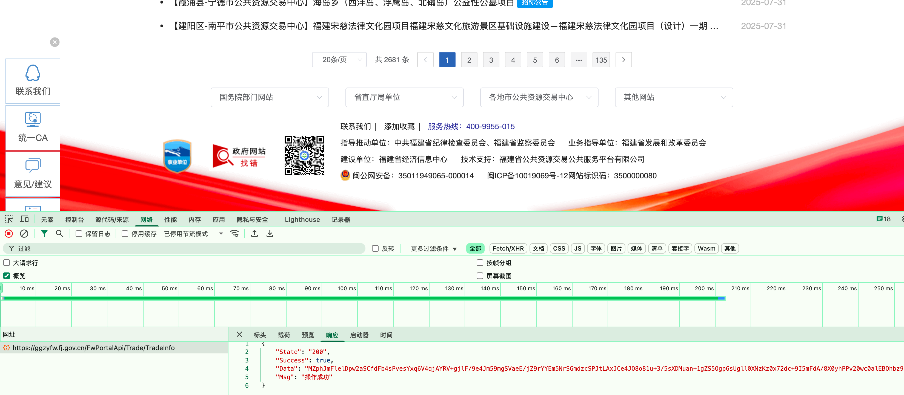

## 2.再看请求头 发现请求头有portal-sign
```
curl 'https://ggzyfw.fj.gov.cn/FwPortalApi/Trade/TradeInfo' \
  -H 'Accept: application/json, text/plain, */*' \
  -H 'Accept-Language: zh-CN,zh;q=0.9' \
  -H 'Connection: keep-alive' \
  -H 'Content-Type: application/json;charset=UTF-8' \
  -H 'Origin: https://ggzyfw.fj.gov.cn' \
  -H 'Referer: https://ggzyfw.fj.gov.cn/business/list/' \
  -H 'Sec-Fetch-Dest: empty' \
  -H 'Sec-Fetch-Mode: cors' \
  -H 'Sec-Fetch-Site: same-origin' \
  -H 'User-Agent: Mozilla/5.0 (Macintosh; Intel Mac OS X 10_15_7) AppleWebKit/537.36 (KHTML, like Gecko) Chrome/138.0.0.0 Safari/537.36' \
  -H 'portal-sign: a2262acc67c874bcfb428c69b3252d96' \
  -H 'sec-ch-ua: "Not)A;Brand";v="8", "Chromium";v="138", "Google Chrome";v="138"' \
  -H 'sec-ch-ua-mobile: ?0' \
  -H 'sec-ch-ua-platform: "macOS"' \
  --data-raw '{"pageNo":1,"pageSize":20,"total":2681,"AREACODE":"","M_PROJECT_TYPE":"","KIND":"GCJS","GGTYPE":"1","PROTYPE":"","timeType":"6","BeginTime":"2025-02-01 00:00:00","EndTime":"2025-08-01 23:59:59","createTime":"","ts":1754009049853}'
```

所以要做的就是两件事:
1.找到portal-sign签名方法,然后获取签名
2.找到解密方法

## 3.尝试获取签名方法

1.搜索decrypt, 注意刷新整个页面
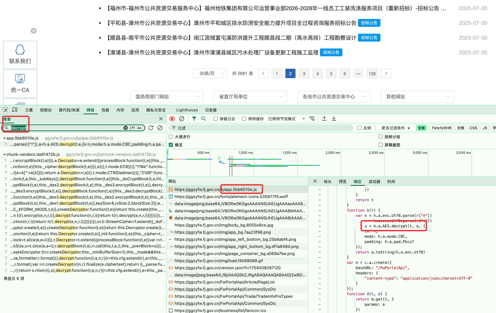

2.搜索portal-sign, 找到sign方法
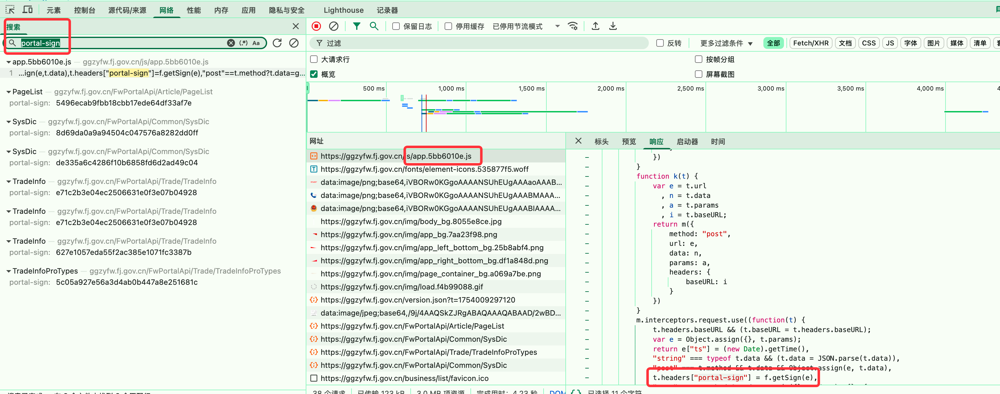


## 获取数据
1.安装execjs
```pip3 install pyexecjs```
2.解析js
将js文件拷贝到pycharm, 好处是可以快速分析文件
打断点,运行

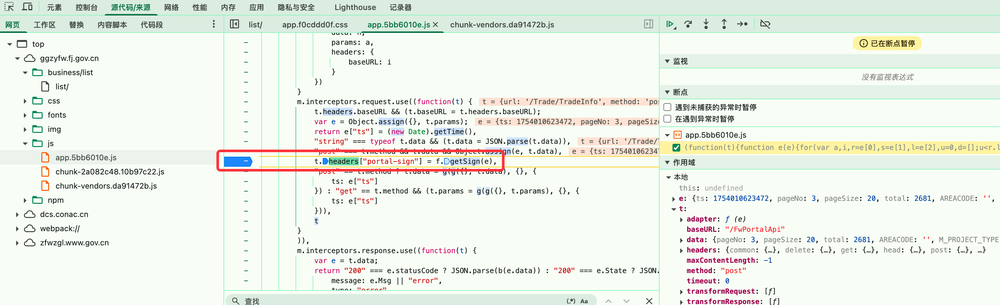
可以看到e是请求参数
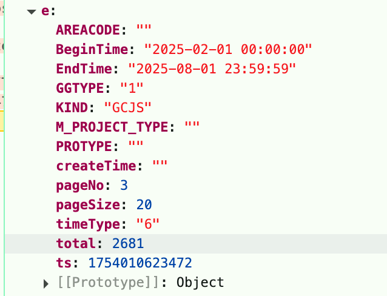

getSign是下面函数
```js
function d(t) {
            for (var e in t)
                "" !== t[e] && void 0 !== t[e] || delete t[e];
            var n = r["a"] + u(t);
            return s(n).toLocaleLowerCase()
        }
```
然后分析r、u、s是什么?

找到r["a"] = B3978D054A72A7002063637CCDF6B2E5

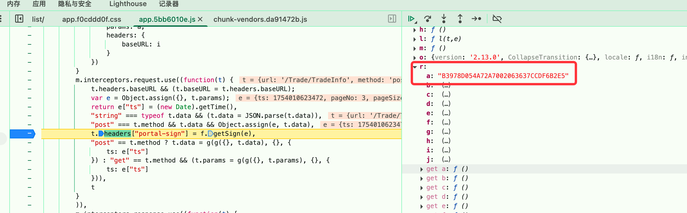

u是个函数

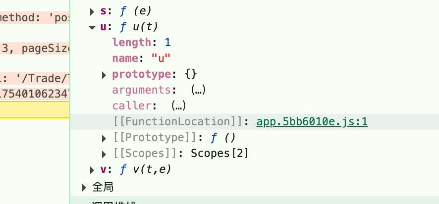
```
function u(t) {
            for (var e = Object.keys(t).sort(l), n = "", a = 0; a < e.length; a++)
                if (void 0 !== t[e[a]])
                    if (t[e[a]] && t[e[a]]instanceof Object || t[e[a]]instanceof Array) {
                        var i = JSON.stringify(t[e[a]]);
                        n += e[a] + i
                    } else
                        n += e[a] + t[e[a]];
            return n
        }
```
l是什么呢?
```js
function l(t, e) {
    return t.toString().toUpperCase() > e.toString().toUpperCase() ? 1 : t.toString().toUpperCase() == e.toString().toUpperCase() ? 0 : -1
}
```


s是个函数
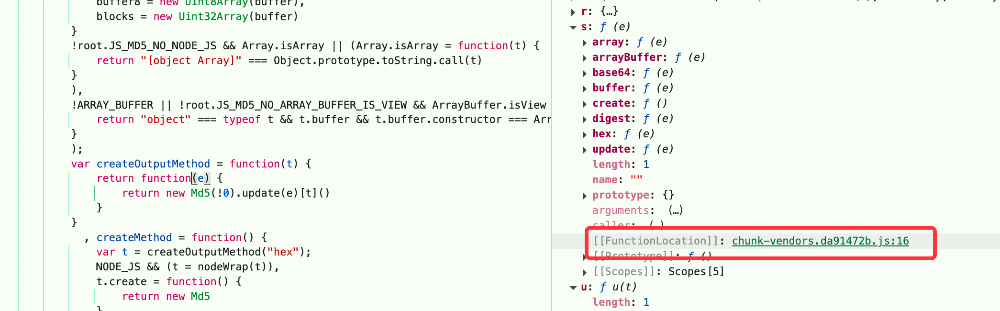

```js
return function(e) {
    return new Md5(!0).update(e)[t]()
}
```
那t是什么呢
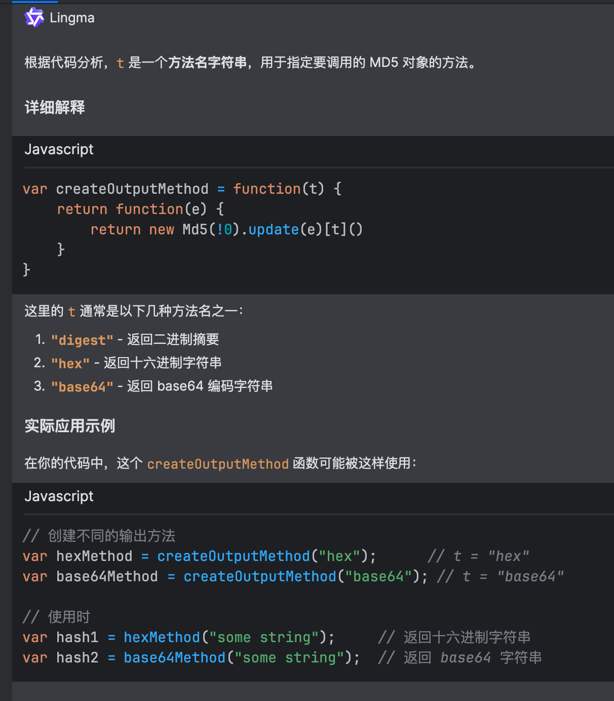
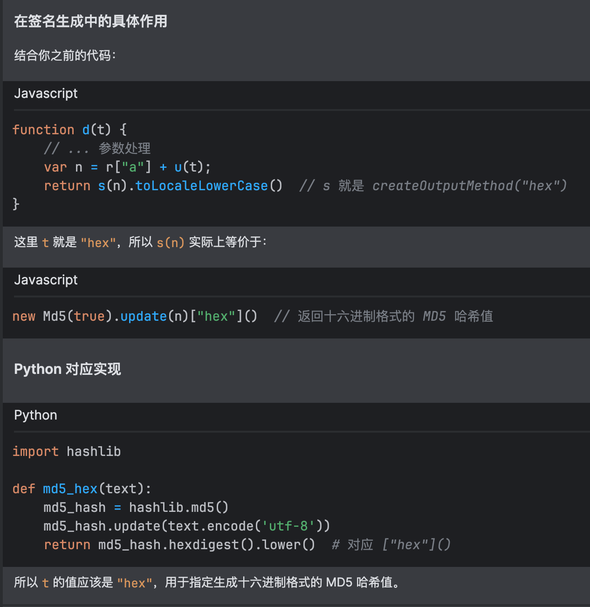

```npm install crypto-js```

接下来是解密, 找到解密代码
```js
function b(t) {
    var e = h.a.enc.Utf8.parse(r["e"])
      , n = h.a.enc.Utf8.parse(r["i"])
      , a = h.a.AES.decrypt(t, e, {
        iv: n,
        mode: h.a.mode.CBC,
        padding: h.a.pad.Pkcs7
    });
    return a.toString(h.a.enc.Utf8)
}
```
ai派上用场
```js
// 引入 crypto-js 库，这是最常用的 JavaScript 加密库
const CryptoJS = require('crypto-js');

// 解密函数
function decryptData(encryptedData, key, iv) {
    // 将密钥和 IV 转换为 CryptoJS 格式
    const parsedKey = CryptoJS.enc.Utf8.parse(key);
    const parsedIv = CryptoJS.enc.Utf8.parse(iv);
    
    // 执行 AES 解密
    const decrypted = CryptoJS.AES.decrypt(encryptedData, parsedKey, {
        iv: parsedIv,
        mode: CryptoJS.mode.CBC,
        padding: CryptoJS.pad.Pkcs7
    });
    
    // 将解密结果转换为 UTF-8 字符串并返回
    return decrypted.toString(CryptoJS.enc.Utf8);
}
```
接下来找到: key, iv 就好了
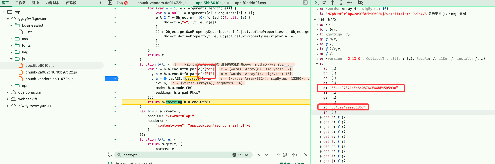

